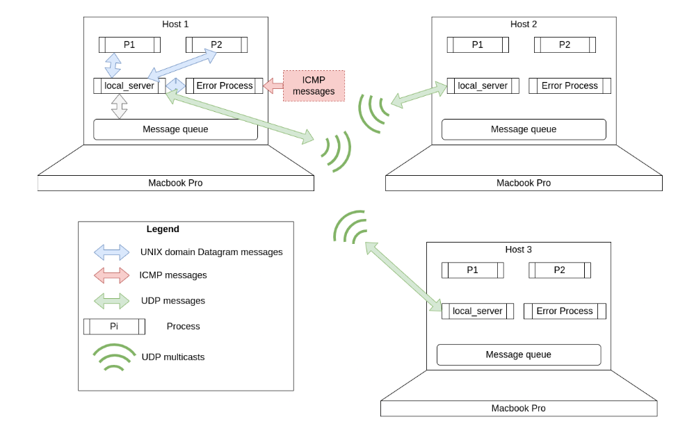

# Network Message Bus

**Assignment 2 for course IS F462: Network Programming**

### Team Members: 
- [Anirudh Singh](https://github.com/anirudhs001) (2019A7PS0107P) 
- [Dhruv Rawat](https://github.com/thedhruvrawat) (2019B3A70537P)

## Testing:
To compile all the files run:
```bash
$ make
$ sudo ./local_server.o # to start the server (one per host):
$ sudo ./driver.o # to start the driver (any number per host)
```
To test the error process, generate icmp messages using nping:
```
$ sudo nping -c 1 --icmp --icmp-type 3 ip
```
where `ip` is the ip address of the host to which we need to send the icmp packets

> To see the available interfaces, use `ifconfig`


## Overview




Our message queue NMB is built to be as similar to the normal message queue as possible. 


### Creating a msgqueue:
To create a message queue, user will call `msgget_nmb()`. Similar to the file descriptor `msgid` returned by `msgget`, `msgget_nmb` returns a struct which contains the fd of the unix domain datagram socket and the address of the unix domain server running on the local_server. This struct is used similar to msgid while passing to `msgrcv_nmb` and `msgsnd_nmb`.
Unlike `msgget`, `msgget_nmb` does not take key and msgflag parameters. This is because according to the required specification, there can only be one message queue per host, which takes way the need for the key parameter. Also, we have delegated the task of creating the single message queue to the local_server process, which takes away the need of msgflag.


### Sending messages:
To send messages, user will call `msgsnd_nmb(MSGQ_NMB nmb, const void *msgp, size_t msgsz, int msgflag)`. 

The prototype is similar to the normal msgsnd, the only difference being in the first argument.

nmb is the variable returned my `msgget_nmb`, 

`mgp` is the pointer to the memory location which contains the data we need to send. 

The object `msgp` points to must have the field: `m_type` and can have any optional field/fields to store the message data.

`msgsz` contains the size (in Bytes) of the data (excluding `m_type`).

`msgflag` contains the flags similar to those in msgsnd. The normal msgsnd supports only the `IPC_NOWAIT` flag, which makes msgsnd non-blocking. To support this flag, we also make all the blocking calls non-blocking by passing `MSG_NOWAIT` to all udp sendto/recvfrom calls and `IPC_NOWAIT` to all msgsnd/msgrcv calls.  ***See NOTE1***.

#### **How it works:**

The following steps are executed:
1. `driver` sends message to `local_server` via UNIX domain datagram socket
2. `local_server` multicasts this message
3. all hosts receive this message. They all read the message, and if their IP matches with the IP encoded in the m_type of the message, they push this message in the local message queue

### Receiving messages:
To receive messages, user will call `msgrcv_nmb(MSGQ_NMB nmb, void *msgp, size_t msgsz, long msgtype, int msgflag)`

`nmb` is returned by `msgget_nmb`

`msgp` is the pointer to memory location which should contain the message data

`msgsz` will be populated with the size of the message

`msgtype` is the type of the message we want to receive. This value should be equal to the unique message type of the user calling this function (This should be done by the user, and is not checked while fetching messages)

`msgflag` contains the flags similar to those in msgrcv. The normal msgrcv supports 3 flags : `IPC_NOWAIT`, `MSG_NOERROR` and `MSG_EXCEPT`. Our implementation supports all of them except `MSG_EXCEPT`, because each user is only suppsed to access their own messages hence there is no point of using this flag.

`MSG_NOERROR` is passed as it is to msgrcv during the execution of `msgrcv_nmb`

`IPC_NOWAIT` is implemented in the same way as in msgsnd, where all blocking calls are made non-blocking by passing the appropriate flags. ***See NOTE1.***


#### **How it works:**
The following steps are executed:
1. `driver` sends request for it's `m_type` to `local_server` via UNIX domain datagram socket
2. `local_server` receives request
3. `local_server` reads the message from the local message queue with the corresponding m_type
4. `local_server` sends this message back to the requesting process via UNIX domain datagram socket.

#### **Processes in play:**
1. The `local_server` (1 per each host). shown as P0 in the diagram below
2. The `error process` (1 per each host). shown as Pz on the diagram above
3. `driver` processes (multiple per each host). each host can have multiple drivers using the NMB.

### The Error Process


For each ICMP error msg, the error process does the following things:
1. the `error process` reads the ICMP message, and sends the error to the `local_server` using UNIX domain datagram socket
2. `local_server` reads the error, and multicasts it.
3. All the `local_servers` (including the one that sent it) receive the UDP multicast, and send it to their corresponding error processes.
3. the `error process` now receives a UNIX domain datagram message, and displays it.

> **NOTE1** : For `IPC_NOWAIT`, our NMB has 2 levels of support, controlled by the `STRICT_NOWAIT` flag in `consts.h`
If `STRICT_NOWAIT` = 0 (default), on passing the `IPC_NOWAIT` flag, `msgsnd_nmb` and `msgrcv_nmb` will only pass the flag as it is to msgsnd and msgrcv.
If `STRICT_NOWAIT` = 1, along with the default behaviour, `MSG_DONTWAIT` flag will be passed to all sendto/recvfrom calls to all UNIX/UDP sockets made during the execution of `msgsnd_nmb/msgrcv_nmb`. This will ensure that `msgsnd_nmb/msgrcv_nmb` is completely non-blocking, but might increase its rate of failure since sendto/recvfrom calls might not get completed.

> **NOTE2** : The interface through which the UPD messages are transmitted is defined in `consts.h` in the `INTERFACE` constant. To use the program on a different system, change this value to the corresponding interface on the system. 
